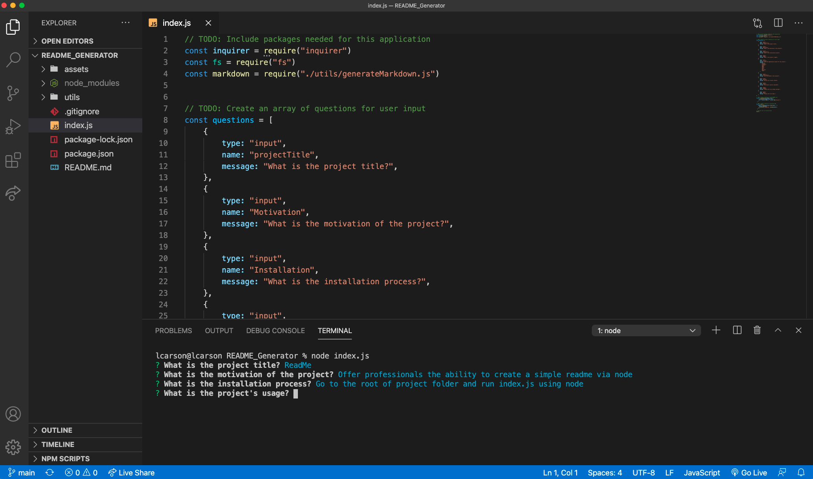

# README Generator

## Table of Contents
* Purpose of Project
* Usage
* Contributors
* Installation
* Contact
* Links

## Purpose of Project
The purpose of this project is to provide professionals with the ability to quickly create a README for a new project.

## Usage
This project can be run at the root of your project folder, using node.js.

## Contributors
Latuanja Carson

## Installation
node index.js

## Contact
Questions? Contact Me:
* Email: latuanja.c@gmail.com
* GitHub: https://github.com/latuanja

## Links
* GitHub Repo: https://github.com/latuanja/README_Generator
* Demo: https://drive.google.com/file/d/1BFb5pHTBHycaa0SGl38p9gl1KwdFqwjp/view?usp=sharing

